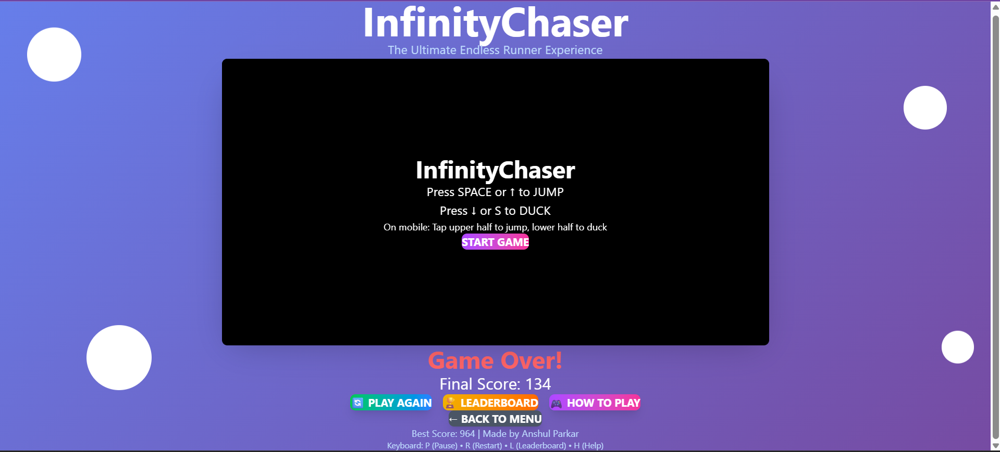
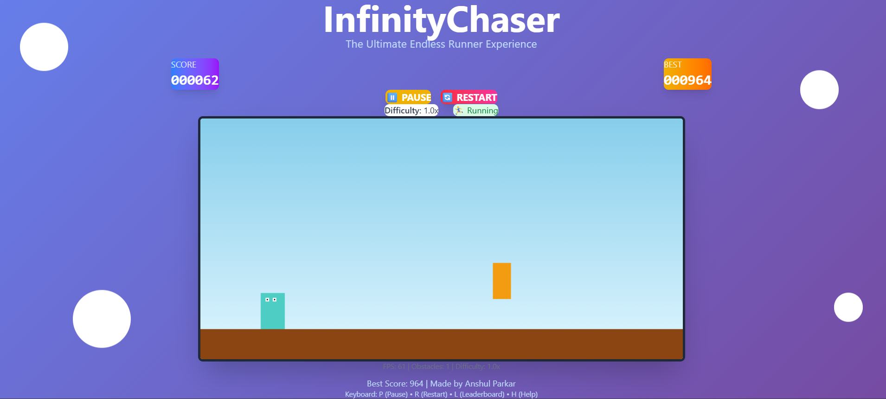

# InfinityChaser

A lightweight endless runner game built with React, Vite, and Tailwind CSS.

[WATCH DEMO VIDEO](https://www.youtube.com/watch?v=QMulMVqO9bI)




## 📦 Setup
1. Clone the repository:
  ```bash
  git clone https://github.com/AnshulParkar/infinityChaser.git
  cd infinityChaser
  ```
2. Install dependencies:
  ```bash
  npm install
  ```
3. Start development server:
  ```bash
  npm run dev
  ```
4. Build for production:
  ```bash
  npm run build
  ```


## 🎮 Controls

### 🖥️ Desktop
| Action | Keys |
|--------|------|
| Jump | `SPACE`, `↑`, `W` |
| Duck | `↓`, `S` |
| Pause/Resume | `P`, `ESC` |
| Restart | `R` |
| Leaderboard | `L` |
| Help | `H` |

### 📱 Mobile
- **Jump**: Tap upper half of the screen
- **Duck**: Tap and hold lower half of the screen


## 🚀 Features

### ✨ Core Gameplay
- **Endless Running**: Infinite procedurally generated obstacles
- **Jump & Duck Mechanics**: Precise controls for avoiding obstacles
- **Progressive Difficulty**: Game speed increases as score grows
- **Real-time Scoring**: Points accumulate continuously with bonus for obstacle avoidance
- **Collision Detection**: Pixel-perfect collision system

### � Game Features  
- **Pause/Resume**: Press P or ESC to pause anytime
- **Restart**: Quick restart with R key or restart button
- **Best Score Tracking**: Automatically saved to localStorage
- **Sound Effects**: Audio feedback for jumps, collisions, and achievements
- **Responsive Design**: Works on desktop and mobile devices

### 📱 Mobile Optimized
- **Touch Controls**: Tap upper half to jump, lower half to duck
- **Responsive Layout**: Adapts to different screen sizes
- **Mobile-friendly UI**: Optimized buttons and spacing

### 🎨 UI/UX
- **Smooth Animations**: Powered by Framer Motion and GSAP
- **Modern Design**: Gradient backgrounds and glass-morphism effects
- **Visual Feedback**: Button hover effects and animations
- **Accessibility**: Keyboard navigation and screen reader support


## 🏗️ Tech Stack

### Core Technologies
- **React 19.1.1**: Component-based UI framework
- **Vite 7.1.2**: Fast build tool and dev server
- **Tailwind CSS 4.1.12**: Utility-first CSS framework

### Animation Libraries
- **Framer Motion**: React animation library
- **GSAP**: High-performance animations

### Development Tools
- **ESLint**: Code linting and formatting
- **PostCSS**: CSS processing
- **Vite Plugin React**: React support for Vite

## 🐞 Known Issues
- Audio requires user interaction to start in some browsers
- Fixed canvas dimensions may not suit very small screens
- Limited obstacle variety; no background music
- Leaderboard uses mock data; no backend integration yet

## 📂 Project Structure

```
infinityChaser/
├── public/
│   └── assets/             # Game assets (images, sounds)
├── src/
│   ├── components/
│   │   ├── GameCanvas.jsx  # Main game logic and rendering
│   │   ├── HUD.jsx         # Score display and controls
│   │   ├── Leaderboard.jsx # Score leaderboard
│   │   └── Controls.jsx    # Help and instructions
│   ├── hooks/
│   │   └── useGameLoop.js  # Game loop and physics
│   ├── data/
│   │   └── leaderboard.json# Mock leaderboard data
│   ├── styles/
│   │   └── globals.css     # Custom CSS animations
│   ├── App.jsx             # Main app component
│   ├── main.jsx            # App entry point
│   └── index.css           # Global styles
├── package.json
└── README.md
```

## 🎯 Game Mechanics

### Scoring System
- **Base Score**: +1 point per frame while running
- **Obstacle Bonus**: +10 points per obstacle cleared
- **Milestone Rewards**: Special notifications every 500 points
- **Difficulty Scaling**: Speed increases every 1000 points

### Obstacles
- **Red Obstacles**: High obstacles - requires jumping
- **Yellow Obstacles**: Low obstacles - requires ducking
- **Dynamic Spawning**: Random obstacle generation
- **Increasing Speed**: Obstacles move faster as difficulty increases

### Physics
- **Jump Mechanics**: Realistic gravity and velocity
- **Duck System**: Temporary height reduction
- **Collision Detection**: Precise bounding box collision
- **Smooth Movement**: 60fps game loop with delta time

## � Leaderboard

The game includes a mock leaderboard system that:
- Shows top 10 scores
- Displays current session score
- Saves best score locally
- Shows player ranking
- Includes achievement celebrations

## 🎨 Customization

### Adding New Obstacles
```javascript
// In GameCanvas.jsx - spawnObstacle function
const obstacleTypes = ['high', 'low', 'moving']; // Add new types
```

### Modifying Game Speed
```javascript
// In useGameLoop.js - GAME_CONFIG
OBSTACLE_SPEED: 5,        // Base speed
DIFFICULTY_INCREASE_INTERVAL: 10000, // Speed increase interval
```

### Custom Animations
```css
/* In src/styles/globals.css */
@keyframes customAnimation {
  /* Your animation keyframes */
}
```

## 🚧 Future Enhancements

### Planned Features
- [ ] Power-ups and special abilities
- [ ] Multiple character skins
- [ ] Online leaderboards
- [ ] More obstacle types
- [ ] Background music
- [ ] Achievement system
- [ ] Daily challenges

### Performance Optimizations
- [ ] Sprite sheet implementation
- [ ] Object pooling for obstacles
- [ ] Web Workers for physics calculations
- [ ] PWA support for offline play

## 🤝 Contributing

We welcome contributions! Please follow these steps:

1. Fork the repository
2. Create a feature branch (`git checkout -b feature/amazing-feature`)
3. Commit changes (`git commit -m 'Add amazing feature'`)
4. Push to branch (`git push origin feature/amazing-feature`)
5. Open a Pull Request


---

<div align="center">
  
**Made with ❤️ by [Anshul Parkar](https://github.com/AnshulParkar)**

⭐ Star this repo if you enjoyed the game!

[Play Game](https://infinitychaser.netlify.app) • [Report Bug](https://github.com/AnshulParkar/infinityChaser/issues) • [Request Feature](https://github.com/AnshulParkar/infinityChaser/issues)

</div>

